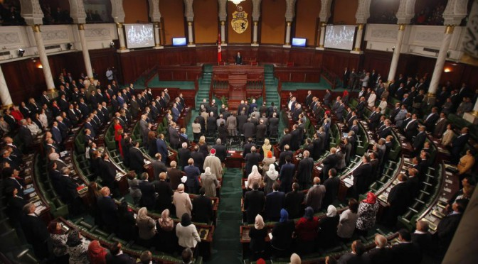

### Hello!

Last month, our country organized, successfully the third, free, democratic, and general elections.
Though elections are not really a challange anymore for the country, in the social, and political sense, security and fraud issues are, and should always be regarded as a serious matter of state. 

In this regard, elections were made, it is in the core values of democracy, which establishes a state of institutions independent of the ruling-elite's agenda and capable of maintaining order and state function in extreem, unlikely, and emergency senarios.

In this context, I would like to adress the issue of The Tunisian parliament, which emerges each election in a more colorized pattern, and while some regard this as a positive output, others, myself included, think that this state, may harm the stability of the functioning of the country.

In the Tunisian constitution, the center of power, is the parliament, as it nominates the PM, which is later appointed by the president, whom have no real executive power in matter of internal affairs. 
Adding to that the decomposition of the pariliament with no clear majority, one, will start thinking about the dissolution of the executive power over the parlimentary blocks who are to form the new government.

The process it self of forming the government by political parties is not problematic at this point, what is problematic though is the time consuming reality that parties have to face, to make compromises and find ideological deals to converge into a single majority, which takes time, energy, and may harm the stability of some major parties who's role is deterministic for the politics in the country, only to FORM a government, without any further debate about how to govern, and who should govern, and what competences does the government needs.

And for this reason, I am going to start a research about the potential changes that legislators can make in order for elections to produce a parliament capable of governing and ruling this countryespecially in these hard times, by assessing the effieciency of voting systems on the voting data in the last general election. 

### EDIT-1-

The data from the ["ISIE"](http://www.isie.tn/) website is in a PDF format, and yes, it is scanned apparently, therefore, alots of work was needed to get the data in a tabular format (csv).

For this speciic purpose I used the web interface with [tabula](https://tabula.technology/) to extract the tabular data from the pdf, and yet I had many anomalies in few files which I had to treart individually.

You can find the final data, and the Rmd file of the process in my [repository](https://github.com/bennour007/elections).

PS1: The process file is called ["wrangle_2.Rmd"](https://github.com/bennour007/elections/blob/master/wrangle_2.Rmd) , and the data is stored in ["final data"](https://github.com/bennour007/elections/tree/master/final_data).

PS2: Some final files migh contain an additional row, summing up all the columns one by one.

